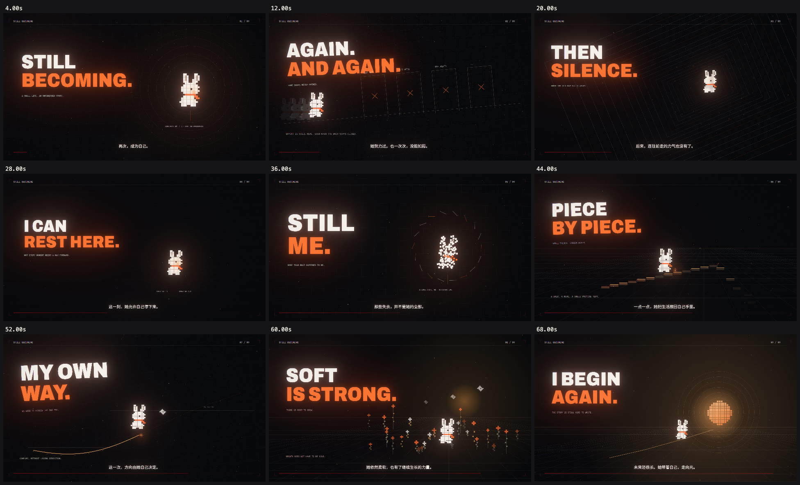

# Still Becoming · 再次，成为自己

A 72-second pixel-animal short about finding yourself after hardship. An ivory rabbit with an orange scarf moves through failed attempts, a fall, rest, recognition, rebuilding, and a warmer future.

Adapted from [mexicat/pdoom-video](https://github.com/mexicat/pdoom-video), preserving its code-rendered animation engine, dark grids, orange light, kinetic typography and film-like post-processing. The new film has nine original scenes, Chinese captions, pixel rabbits and birds, and an original synthesized instrumental score.

[Watch / download the first cut (720p MP4)](preview/still-becoming-v1.mp4)



## Preview

```sh
cd app
bun install --frozen-lockfile
bun run dev
```

Open the printed local URL. Click **播放** or press Space. Seek with the timeline or arrow keys. `?t=36` opens at a specific time. `?film=original` plays the preserved upstream version.

## Export

Requires Bun, Chrome and ffmpeg. From `app/`:

```sh
bun run render
```

The export is written to `out/still-becoming.mp4`. [Story, editing guide, score generation and browser export fallback](docs/STILL-BECOMING.md).

## Validation

```sh
bun run typecheck
bun run build
bun test
```

The first delivered render is 1920×1080 at 30 fps, 72 seconds, with instrumental audio. It uses one temporal sample per frame; the export command defaults to four for further refinement.

## Attribution

Original engine and visual system: mexicat / Giacomo Magnanini, MIT. Original fonts keep their licenses. Chinese type: Noto Sans SC, SIL OFL. New scenes, sprites, text and synthesized score: this adaptation, MIT. The new soundtrack does **not** use the P(doom) song or lyrics.

[Original project documentation and music credits](README-UPSTREAM.md) · [Original source](https://github.com/mexicat/pdoom-video)
